# Lase_Readme

### Introduction

- **Briefly introduction.** When analyzing programs with complex input formats, symbolic execution often fails to generate inputs that can pass the parsing stage. We propose synthesizing input grammars online using valid inputs obtained from symbolic execution, thereby improving the symbolic execution process and mitigating this issue. Since the quality of the synthesized grammar is critical for the performance of Lase, we also improve the grammar synthesis by introducing a new generalization operation and a token-level synthesis method. In addition, we propose a new search strategy to enhance the efficiency of symbolic execution. We present **Lase** and make this artifact to evaluate the effectiveness of our method.

- **Purpose.** This artifact aims to evaluate the following two research questions:

  - ***RQ1**: How effective do online grammar synthesis and our new search heuristic benefit token-based symbolic execution? Here, effectiveness means higher code coverage.*
  - ***RQ2**: How effective and efficient is our token-level grammar synthesis method compared with the state-of-the-art methods? Here, effectiveness means higher precision and recall, and efficiency is measured by the synthesis time.*

- **Claims.**

  - **For RQ1**, we claim that online grammar synthesis and our new search heuristic can improve the effectiveness of  symbolic execution. More specifically, online grammar synthesis can improve the code coverage behind the paring code and the new search heuristic can guide symbolic execution cover more parsing code more quickly. We evaluate the code coverage of Lase and the baselines with 15 parsing programs. We also collect the valid inputs generated during symbolic execution to evaluate the code coverage behind the paring code with 5 compilers or interpreters. 

    - The benchmarks are listed below.

      Parsing programs:

      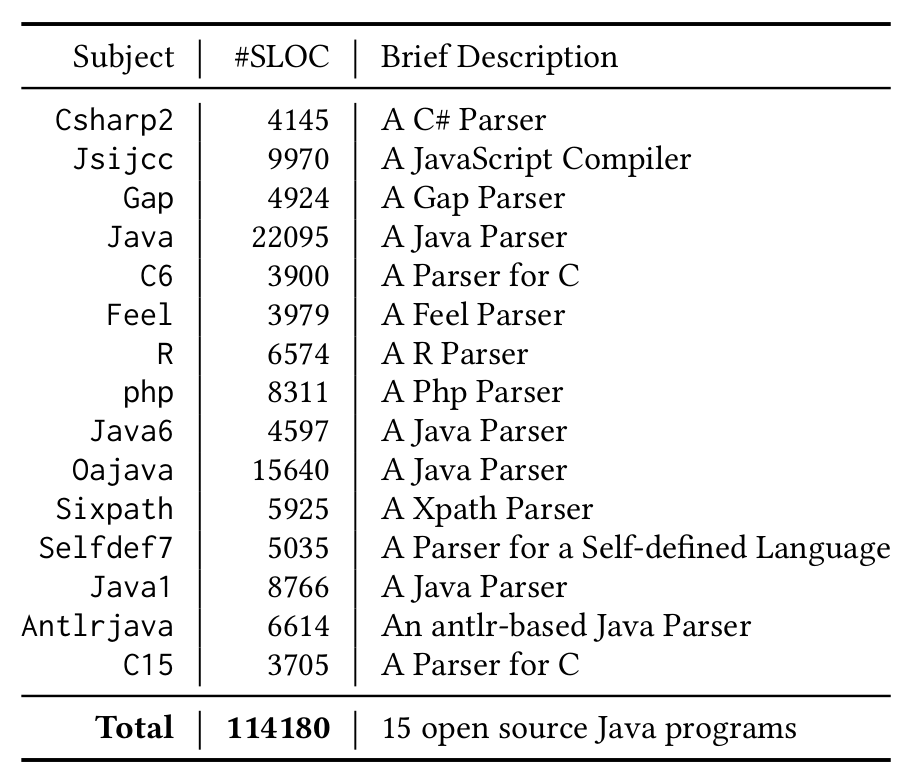

      Compilers or interpreters: Janino, CLoli, SimpleCsharp, Jphp, and Jscript.        

  - **For RQ2**, we claim that token-level grammar synthesis improves the grammar’s precision and recall with an acceptable time overhead for most benchmarks. We compare the precision, recall, F1-score  and running time of Lase and the baselines.

### Hardware Dependencies

- A minimum of 32 GB RAM is required for Lase. And since we ran 15 programs 3 times in 6 modes, we suggest running them in parallel with large memory. For example, in our experiment, we use a server with 768 memory to run 24 processes simultaneously.
- Our experiment does not have very strict requirements for CPUs, but different CPUs may have a slight impact on the results.
- Setting in our experiments. All the experiments are carried out on a server with Intel Xeon (Cascade Lake) Platinum 8269CY(2.5GHz), 104 cores and 768G memory, and the OS is Ubuntu Linux 22.04.

### Getting Started Guide

- We provide a docker image for you to reproduce the results.

- Pull and run the docker.
  - **docker pull lase2025/lase_oopsla25:latest**                      *#pull the docker images*
  - **docker images**                                                                                       *#check the docker*
  - **docker run -it lase2025/lase_oopsla25:latest /bin/bash**                 #run the docker
  
- A small example to run our artifact: **(KICK THE TIRES)**

  - **cd /home/Lase && ./run_RQ1_exam.sh**

    - **For RQ1**, we run the benchmark `Antlrjava` in 6 modes for 6 minutes to explain the artifact. The 6 modes are  ["BFS","DFS","GSDSE","NS","GS_DFS","GS_BFS"], which represent GADSE under the BFS strategy, GADSE under the DFS strategy, Lase, GADSE with new search strategy, GADSE with grammar synthesis method under the DFS strategy and the BFS strategy, respectively.

    - Please **wait for about max{(6 / CoreNum) ,1 }* 6 mins** and the results are displayed as follows.

      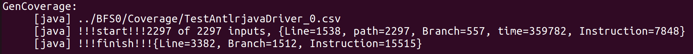

      In the above picture, `../BFS0/Coverage/TestAntlrjavaDriver_0.csv` indicates the method is GADSE under the BFS strategy and the results are coverage of the parsers. And "`2297 of 2297 inputs, {Line=1538, path=2297, Branch=557, time=359782, Instruction=7848}` " indicates this method generates 2297 inputs, covering 1538 lines, 557 branches and 7848 instructions.

      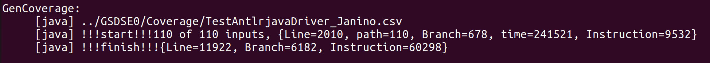

      In the above picture, `../GSDSE0/Coverage/TestAntlrjavaDriver_Janino.csv` indicates the method is Lase and the results are coverage of the compiler Janino. 

    - There are 12 coverage results, 6 for parsers and 6 for compilers. We show 2 results above for brevity.

  - **cd /home/Lase/grammar && ./run_RQ2_exam.sh**

    - **For RQ2**, we run the R parser under 6 modes and get the results of precision, recall and F1 score. The 6 modes are Lase (Glade equipped with the token-level synthesis method and Exchange operation), Glade-t (Glade equipped with the token-level synthesis method), Lase-c (Glade equipped with Exchange operation) , Glade-c (vanilla Glade), Arvada and Treevada respectively. 
    - It takes **about 15 minutes** to finish this step. 
    - Note that since the recall evaluation is time-consuming, we only use 10 inputs to evaluate the recall here to save the time.

  - **cd /home/Lase/grammar/lase/results/TestRDriver && ls** 

    - You can see the results shown below.

      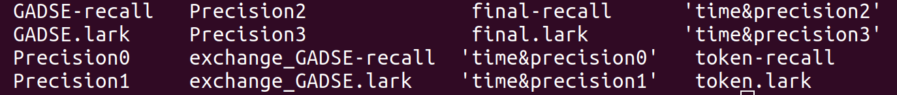

    - This image shows the output files for four modes of grammar synthesis evaluation. The modes, indexed from 0 to 3, correspond to `modeName = ['final', 'token', 'GADSE', 'exchange_GADSE']`, representing Lase, Glade-t, Glade-c, and Lase-c respectively. For example, `time&precision1` records the grammar synthesis time for the Glade-t mode (`token`), `token-recall` contains recall evaluation results for this mode, and `Precision1` stores precision evaluation results. Files ending with `.lark` are the synthesized grammars for each mode.

    - You can find the recall and precision results by using the tool `tail`.

      - For example, **tail -10 final-recall**

      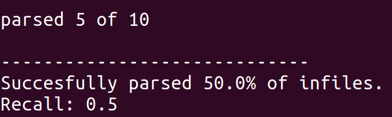

      - **tail -1 Precision0**

        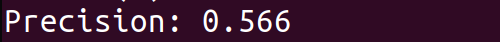

  - **cd /home/Lase/grammar/vada/arvada-results && ls** 

    - You can see the results shown below.

      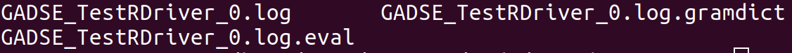

    - You can find the recall and precision results by using the tool `tail`.

      - **tail -10 GADSE_TestRDriver_0.log.eval**

        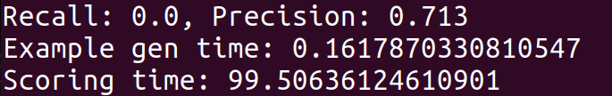

    - You can get the grammar synthesis time in GADSE_TestRDriver_0.log (time spend building grammar).

      -  tail -10 GADSE_TestRDriver_0.log

        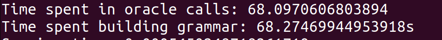

  - **cd /home/Lase/grammar/vada/treevada-results && ls** 

    - Just like Arvada's results.

- Run the experiments please refer to [the next section](#section4).

- Display the results. We save the results in the files with the suffix of ".tex" and you need to use **texstudio** or other tools to visualize them. The detailed information is displayed in [the last section](#section5).

### Step by Step Instructions

- Run the experiments. You can choose any **one** of the following instructions.
  - **cd /home/Lase && ./run_all.sh**                                                              *#run all experiments*
  
    - **Note that run_all.sh will run Lase and baselines 3 or 10 times strictly following the setting of our  paper, so it may take several days to finish it.** 
  
  - Step by step:
  
    1. **export JAVA_HOME=/env/jdk1.7.0_80 && export PATH=\${JAVA_HOME}/bin:\$PATH && cd /home/Lase/DSE/jpf-jdart**
  
       - Set the environment for **RQ1**.
  
    2. Choose **one** of the following instructions.
  
       - **python3 main.py**                   #run all benchmarks under all modes 3 times
       - **python3 main.py [processNum]**
         - Run all benchmark under all modes with processNum concurrent processes. The default number of running processes is the current memory divided by 32GB.
       - **python3 main.py [benchmark] [mode] [times]**
         - Benchmark can be selected from ["TestAntlrjavaDriver","TestPhpDriver","TestSelfdef7Driver","TestJsijccDriver","TestCsharp2Driver","TestFeelDriver","TestGapDriver","TestSixpathParser","TestRDriver","TestJavaparserParser","TestOaJavaParserDriver","TestC6Driver","TestC15Driver","TestJava6Driver","TestJava1Driver"].
         - Mode can be selected from **1 to 6**, which represent GADSE under the BFS strategy, GADSE under the DFS strategy, Lase, GADSE with grammar synthesis method under the BFS strategy and the DFS strategy, and GADSE with new search strategy, respectively.
         - Times indicate running times.
       - **python3 main.py [processNum] [benchmark] [mode] [times]**
  
    3. **cd /home/Lase/DSE/gencov && export JAVA_HOME=/env/jdk-11.0.21 && export PATH=\${JAVA_HOME}/bin:\$PATH  && export PATH=/env/apache-ant-1.9.16/bin:$PATH**
  
       - Set the environment.
  
    4. **ant instrument**
  
       - Instrument the program for evaluating coverage .
  
    5. **python3 main1.py**
  
       - Get the code coverage results and **generate inputs for evaluating grammar synthesis methods**.
  
    6. **cd /home/Lase/grammar && python3 trainsetGen.py && python3 trainsetGen-lase.py**
  
       - Generate inputs for grammar synthesis method evaluation for **RQ2**.
  
    7. **cd /home/Lase/grammar/lase && python3 run_bench.py**
  
       - Run Glade-related grammar synthesis method. It may take a long time to finish this step so you can choose to evaluate one benchmark with one synthesis method as follows.
       - **python3 run_bench.py [processNum]**
       - **python3 run_bench.py [benchName] [mode 1-4] [run_times]**
       - **python3 run_bench.py [processNum] [benchName] [mode 1-4] [run_times]**
    
    8. **python3 run_recall.py && python run_precision.py**
    
       - It may take a long time to finish this step so you can choose to evaluate one benchmark with one synthesis method as follows.
       - **python3 run_precision.py [processNum]**
       - **python3 run_precision.py [benchName] [mode 1-4] [run_times]**
       - **python3 run_precision.py [processNum] [benchName] [mode 1-4] [run_times]**
       - **python3 run_precision.py [processNum]**
       - **python3 run_precision.py [benchName] [mode 1-4]**
       - **python3 run_precision.py [processNum] [benchName] [mode 1-4] **
    
    9. **cd /home/Lase/grammar/vada** 
    
    10. **python3 run.py && python3 run_recall.py**
    
        - Run vada-related grammar synthesis method. It may take a long time to finish this step so you can choose to evaluate one benchmark with one synthesis method as follows.
    
        - **python3 run.py [processNum]**
        - **python3 run.py [benchName] [arvada_rounds:int] [treevada_rounds:int]**
        - **python3 run.py [processNum] [benchName] [arvada_rounds:int] [treevada_rounds:int]**
        - **python3 run_recall.py [processNum]**
        - **python3 run_recall.py [benchName] [arvada_rounds:int] [treevada_rounds:int]**
        - **python3 run_recall.py [processNum] [benchName] [arvada_rounds:int] [treevada_rounds:int]**
    
    11. done.
    
    - **Note that the above instructions do the same thing like in run_all.sh. However, following the above instructions you can solely run one benchmark in one mode. **
    - **Note that with the second group of instructions, you may not  get the tables or figures like in our paper. But we will give the guidance to understand the running output.**
  
- Get the tables or figures like in our paper.
  - **cd /home/Lase/DSE/gencov && python3 computeAver.py**            
    - Get cov.txt and cov1.txt
    - cov.txt and cov1.txt are the coverage results for parsers and compilers.
  - **python3 getResult1Tex.py && python3 getResult2Tex.py  && python3 getNewCmd.py**
    - Generate the tex files (result1.tex, result2.tex and newCmd.tex) from cov.txt and cov1.txt  **for RQ1**. And you can refer to the next section for explanation.
  - **cd /home/Lase/grammar/lase && python3 processData.py && cd /home/Lase/grammar/vada && python3 processData.py**
    - Generate the files, results0, results1, results2 and results3, for evaluating the token-level synthesis method and Exchange operation proposed in Lase. results0, results1, results2, results3 save the results under 4 modes, Lase (Glade equipped with the token-level synthesis method and Exchange operation), Glade-t (Glade equipped with the token-level synthesis method), Lase-c (Glade equipped with Exchange operation) and Glade-c (vanilla Glade), respectively.
    - Generate the files, arvada-results and treevada-results, for evaluating the results of two baselines, arvada and treevada.
  - **cd /home/Lase/grammar/final-result && python3 getExpriResultTex.py**
    - Generate the tex files (experimental_result.tex and execution_time.tex) from the result files above for visualization **for RQ2**. And you can refer to the next section for explanation.
  - We will explain the tables and figures in [the next section](#section5).

### Explanation of the results

- To reproduce the tables and figures presented in our paper, We already downloaded the experimental results from https://github.com/lase2025/Lase.git and saved them to the docker. Specifically, you can follow the instructions below to reproduce the results in our paper.

  - **cd /home/Lase_display**
-  run the visualization scripts [above](#visualization) and replace `Lase` with `Lase_display` in the instructions.
    - For example, "cd /home/**Lase**/DSE/gencov && python3 computeAver.py" should be replaced with "cd /home/**Lase_display**/DSE/gencov && python3 computeAver.py".

- **For RQ1** (the effectiveness of online grammar synthesis and our new search heuristic), we generate result1.tex, result2.tex and newCmd.tex.

  - result1.tex presents the coverage results of a one hour running in different modes on 15 parsers, which is presented as a table like the following one (section 4 of our paper). 

    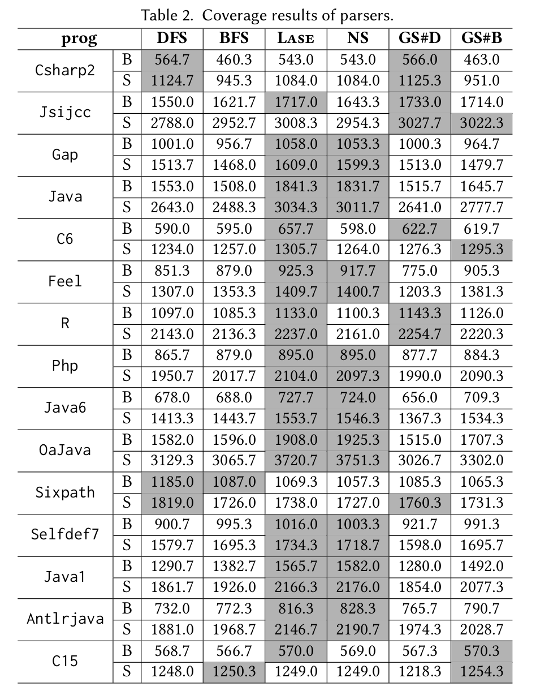

    - Inside the table, prog represents the benchmarks. B and S are branch coverage and statement coverage, respectively, which are the metrics for effectiveness evaluation. DFS and BFS are the baseline method GADSE under the DFS strategy and BFS strategy, respectively. Lase implements our proposed method, which incorporates both the new search strategy and grammar synthesis. And we show the results of GADSE equipped with our new search strategy (NS) and grammar synthesis modular under DFS and BFS strategies (GS#D and GS#B) to inspect the influence of each part. We gray out the best 2 results to inspect the best methods.
    - Note that we randomly sample valid inputs from the synthesized grammar to guide symbolic execution, so the results may vary slightly across runs.

  - result2.tex can generate a figure like the following one (section 4 of our paper).

    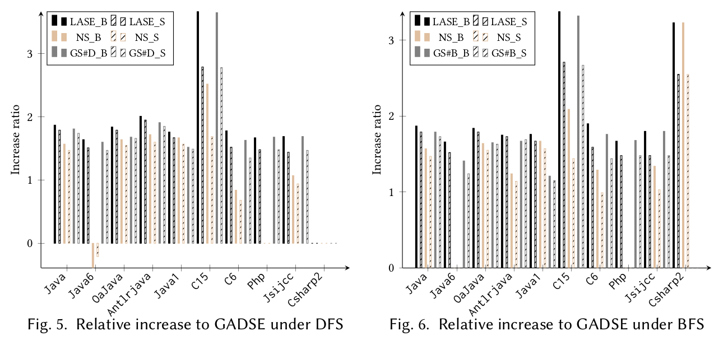

    - reuslt2 shows the coverage improvement of the functionality code of compilers compared to GADSE under the DFS strategy and BFS strategy, respectively. The suffixes "\_B" and "\_S" in the legend indicate branch coverage and statement coverage. The y-axis data (increase ratio) is computed as follows, where GR is the percentage of increase relative to the baseline. $GR = (C_t - C_b)/C_b$, where $C_t$ is the coverage of the target method and $C_b$ is the coverage of the baseline.

      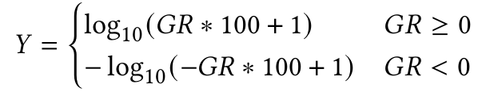

  - newCmd.tex shows the data in our paper. For example, "dfsBrIncreAver" is the average increase of branch coverage when comparing Lase and GADSE under the DFS strategy. "bfsStmtIncreMax" represents the maximum increase in statement coverage among those benchmarks when comparing Lase and GADSE under the BFS strategy. "bfsStmtIncreAverfun" indicates the average increase in statement coverage achieved by Lase compared to GADSE under the BFS strategy across all compilers.

- **For RQ2** (the effectiveness and efficiency of our token-level grammar synthesis method compared with the state-of-the-art methods), we generate experimental_results.tex and execution_time.tex.

  - experimental_results.tex can generate a table as shown below.

    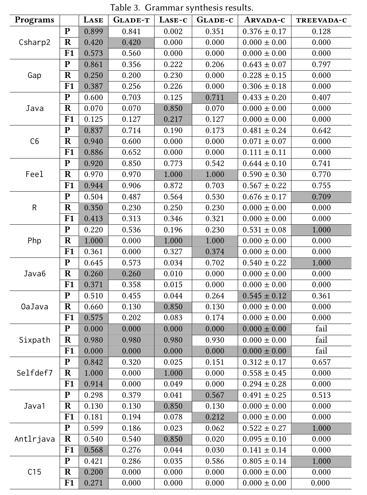

    - Inside the table, Lase represents Glade equipped with the token-level synthesis method and Exchange operation. Glade-t equips Glade with the token-level synthesis method, while Lase-c equips Glade with Exchange operation. In addition, Glade-c indicates the vanilla Glade. Moreover, Arvada-c and Treevada-c are also SOTA character-level grammar synthesis methods.
    - P, R and F1 represent the precision, recall and F1 score of the methods. We use these 3 metrics to evaluate the effectiveness of Lase and its variants.

  - execution_time.tex can generate a table like the following one.

    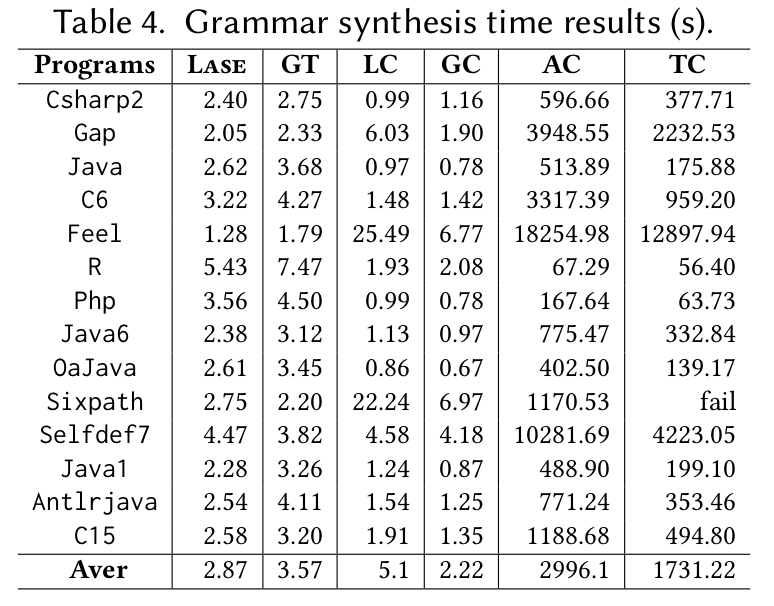

    - In the above table, we use GT as an abbreviation of Glade-t and AC as an abbreviation of Arvada-c. Other methods are presented similarly. Aver means the average.
    - We use the synthesis time to inspect the efficiency of Lase and its variants.